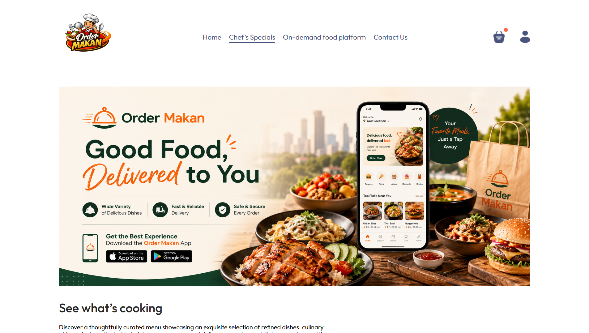
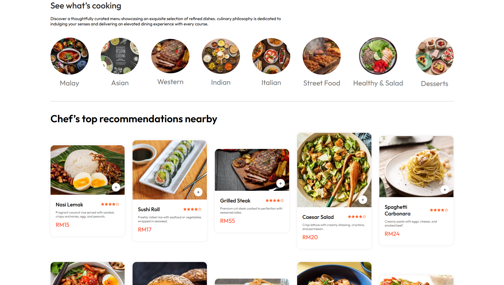
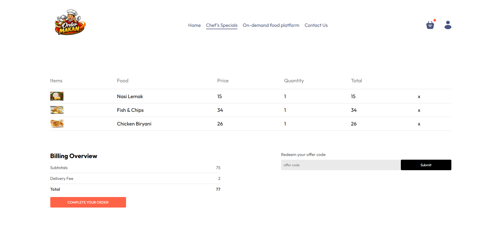
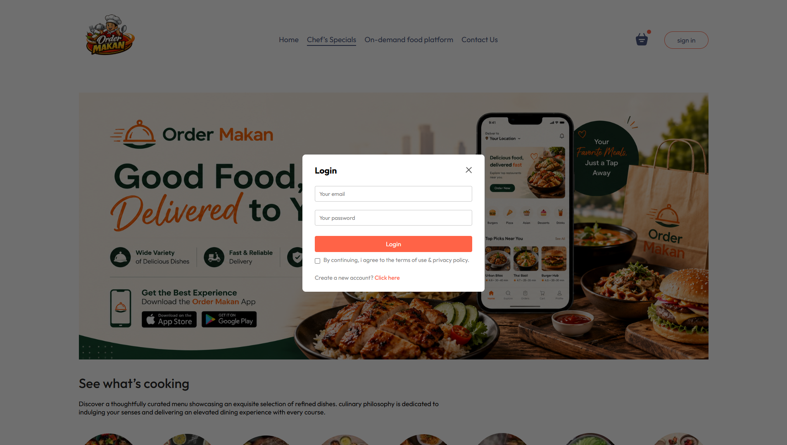
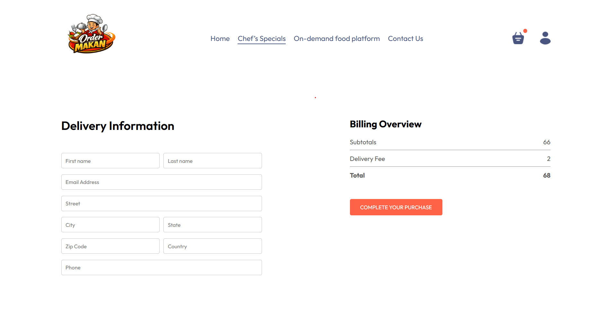
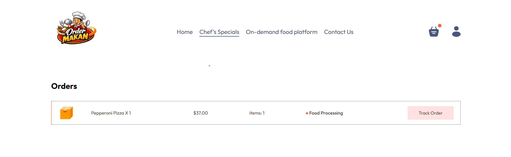
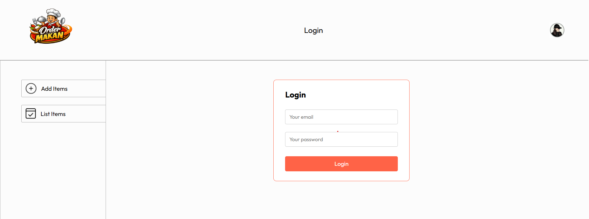
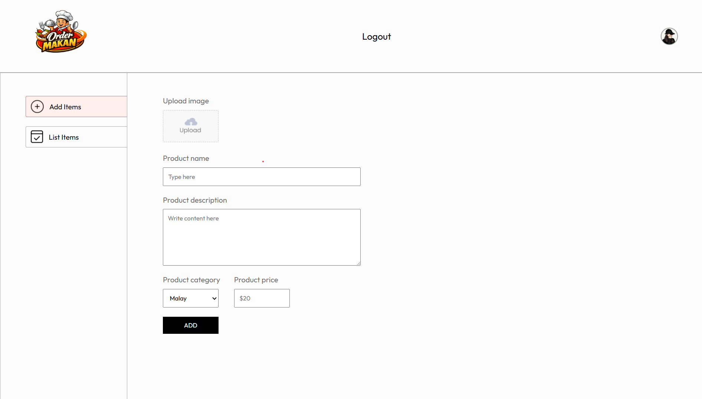
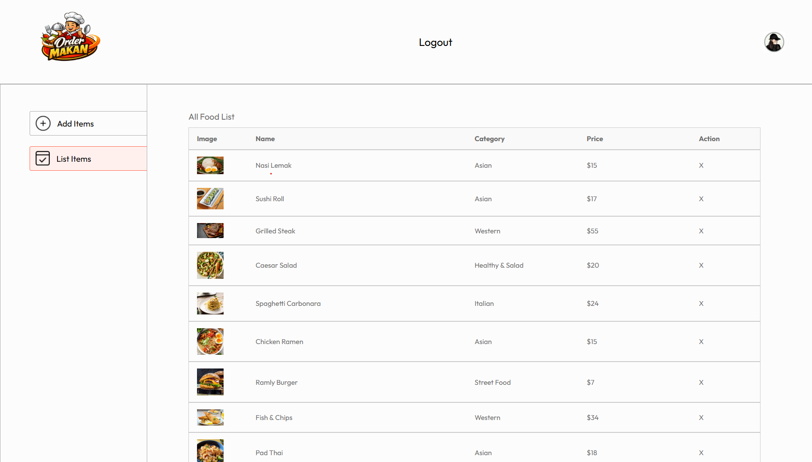

# Order Makan - Food Delivery Web App

Order Makan is a full-stack food ordering application powered by the MERN stack. It delivers a smooth and efficient ordering experience, enabling users to explore menus, place orders, and manage transactions with ease.

## Demo

- User Panel: [https://order-makan-nine.vercel.app/](https://food-delivery-frontend-s2l9.onrender.com/)
- Admin Panel: [https://order-makan-admin.vercel.app/](https://food-delivery-admin-wrme.onrender.com/)

## Key Features

- Customer & Admin dashboards
- Secure authentication with JWT
- Encrypted passwords using bcrypt
- Stripe-powered payment processing
- User registration and login system
- Secure logout functionality
- Shopping cart management
- Seamless order placement flow
- Product management system (Admin)
- File upload 
- Protected RESTful APIs
- Role-based access control (User / Admin)
- Clean and responsive UI/UX
- Interactive system notifications & alerts

## Screenshots


- Home Page




- Food browser Page




- Cart Page




- User Login Popup




- User Data Entry Delivery Address Page




- User Order List Page




- Admin Login Page




- Admin Add Items Page




- Admin List Items Page




## Run Locally

Clone the project

```bash
    git clone https://github.com/shiken94/SEC-12-Main.git -- Folder SEC-12-Assigment3-OrderMakanMERNStack 
```
Go to the project directory

```bash
    cd Order-Makan
```
Install dependencies (frontend)

```bash
    cd frontend
    npm install
```
Install dependencies (admin)

```bash
    cd admin
    npm install
```
Install dependencies (backend)

```bash
    cd backend
    npm install
```
Setup Environment Variables

```
  Create .env file in "frontend" folder and store environment Variables
  
  VITE_LOCAL_BACKEND_URL=YOUR_BACKEND_URL
```
```
  Create .env file in "admin" folder and store environment Variables
  
  VITE_LOCAL_BACKEND_URL=YOUR_BACKEND_URL
```
```
  Create .env file in "backend" folder and store environment Variables
  
  JWT_SECRET=YOUR_SECRET_TEXT
  SALT=YOUR_SALT_VALUE
  MONGO_URL=YOUR_DATABASE_URL
  STRIPE_SECRET_KEY=YOUR_KEY
  VITE_LOCAL_FRONTEND_URL =YOUR_FRONTEND_URL 
```

Start the Backend server

```
    bash
    npm start
```

Start the Frontend server

```
    bash
    npm run dev
```

Start the Backend server

```
    bash
    npm run dev
```
## Tech Stack
```
Frontend
```
* [React](https://reactjs.org/) 
* [Vite](https://vite.dev/)
```
Backend
```
* [Node.js](https://nodejs.org/en)
* [Express.js](https://expressjs.com/)
```
Database
```
* [Mongodb Atlas](https://www.mongodb.com/)
```
Payment gateway
```
* [Stripe](https://stripe.com/)
```
Middleware
```
* [JWT-Authentication](https://jwt.io/introduction)


🔌 API Endpoint Summary

🍔 Foods
```
Method	Endpoint	            Description
POST	/api/food/add	        Create new food item (Admin)
GET	    /api/food/list  	    Get list of food (Admin)
POST	/api/food/remove	    Delete food item (Admin)
```

🛒 Cart
```
Method	Endpoint	            Description
POST	/api/cart/get	        Get user cart
POST	/api/cart/add	        Add item to cart
POST	/api/cart/remove	    Remove item from cart
```

📦 Orders
```
Method	Endpoint	            Description
POST	/api/order/place	    Place new order
POST	/api/order/verify	    Verify Order
POST	/api/order/userorders	View order for user
```

👨‍💼 User
```
Method	Endpoint	            Description
POST	/api/user/register	    Register new user
POST	/api/user/login 	    Login existing user
```

🔐 File Upload
```
Method	Endpoint	    Description
    	/images	        Upload image/file
```

## Deployment
```
The backend application is deployed on Render.
```
```
The frontend and admin application is deployed on Vercel.
```
